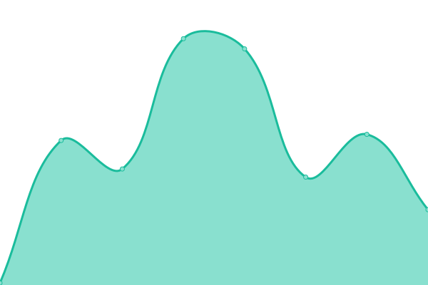

# [📈 Live Status](https://cicd.andiegogiap.com): <!--live status--> **🟧 Partial outage**

This repository contains the open-source uptime monitor and status page for [lntel](http://chishenzhen.ltd), powered by [Upptime](https://github.com/upptime/upptime).

With [Upptime](https://upptime.js.org), you can get your own unlimited and free uptime monitor and status page, powered entirely by a GitHub repository. We use [Issues](https://github.com/qmutz/cicd/issues) as incident reports, [Actions](https://github.com/qmutz/cicd/actions) as uptime monitors, and [Pages](https://cicd.andiegogiap.com) for the status page.

<!--start: status pages-->
<!-- This summary is generated by Upptime (https://github.com/upptime/upptime) -->
<!-- Do not edit this manually, your changes will be overwritten -->
<!-- prettier-ignore -->
| URL | Status | History | Response Time | Uptime |
| --- | ------ | ------- | ------------- | ------ |
|  [Google](https://www.andiegogiap.com) | 🟥 Down | [google.yml](https://github.com/inteI-cloud/cicd/commits/HEAD/history/google.yml) | 

 0ms
     
 | 

<a href="https://cicd.andiegogiap.com/history/google">100.00%</a>
    

|  [Wikipedia](https://lntel.us) | 🟩 Up | [wikipedia.yml](https://github.com/inteI-cloud/cicd/commits/HEAD/history/wikipedia.yml) | 

 255ms
     
 | 

<a href="https://cicd.andiegogiap.com/history/wikipedia">100.00%</a>
    

|  [Hacker News](https://news.ycombinator.com) | 🟩 Up | [hacker-news.yml](https://github.com/inteI-cloud/cicd/commits/HEAD/history/hacker-news.yml) | 

 410ms
     
 | 

<a href="https://cicd.andiegogiap.com/history/hacker-news">100.00%</a>
    

|  [x86-64.pw](https://x86-64.pw) | 🟩 Up | [x86-64-pw.yml](https://github.com/inteI-cloud/cicd/commits/HEAD/history/x86-64-pw.yml) | 

 406ms
     
 | 

<a href="https://cicd.andiegogiap.com/history/x86-64-pw">100.00%</a>
    

|  [b00t_tk](https://b00t.tk) | 🟥 Down | [b00t-tk.yml](https://github.com/inteI-cloud/cicd/commits/HEAD/history/b00t-tk.yml) | 

 0ms
     
 | 

<a href="https://cicd.andiegogiap.com/history/b00t-tk">100.00%</a>
    

|  [b00t_ml](https://b00t.ml) | 🟥 Down | [b00t-ml.yml](https://github.com/inteI-cloud/cicd/commits/HEAD/history/b00t-ml.yml) | 

 0ms
     
 | 

<a href="https://cicd.andiegogiap.com/history/b00t-ml">100.00%</a>
    

|  [b00t.cf](https://b00t.cf) | 🟥 Down | [b00t-cf.yml](https://github.com/inteI-cloud/cicd/commits/HEAD/history/b00t-cf.yml) | 

 0ms
     
 | 

<a href="https://cicd.andiegogiap.com/history/b00t-cf">100.00%</a>
    

|  [b00t.ga](https://b00t.ga) | 🟥 Down | [b00t-ga.yml](https://github.com/inteI-cloud/cicd/commits/HEAD/history/b00t-ga.yml) | 

 0ms
     
 | 

<a href="https://cicd.andiegogiap.com/history/b00t-ga">100.00%</a>
    

|  [b00t.gq](https://b00t.gq) | 🟥 Down | [b00t-gq.yml](https://github.com/inteI-cloud/cicd/commits/HEAD/history/b00t-gq.yml) | 

 0ms
     
 | 

<a href="https://cicd.andiegogiap.com/history/b00t-gq">100.00%</a>
    

|  [BLOG](https://andiegogiap.com/blog) | 🟩 Up | [blog.yml](https://github.com/inteI-cloud/cicd/commits/HEAD/history/blog.yml) | 

 754ms
     
 | 

<a href="https://cicd.andiegogiap.com/history/blog">100.00%</a>
    

|  [HEAD](https://www.google.com) | 🟩 Up | [head.yml](https://github.com/inteI-cloud/cicd/commits/HEAD/history/head.yml) | 

 74ms
     
 | 

<a href="https://cicd.andiegogiap.com/history/head">100.00%</a>
    

|  Secret Site | 🟥 Down | [secret-site.yml](https://github.com/inteI-cloud/cicd/commits/HEAD/history/secret-site.yml) | 

 0ms
     
 | 

<a href="https://cicd.andiegogiap.com/history/secret-site">100.00%</a>
    

|  [TCP ping](68.168.221.170) | 🟩 Up | [tcp-ping.yml](https://github.com/inteI-cloud/cicd/commits/HEAD/history/tcp-ping.yml) | 

 74ms
     
 | 

<a href="https://cicd.andiegogiap.com/history/tcp-ping">100.00%</a>
    

<!--end: status pages-->

[**Visit our status website →**](https://cicd.andiegogiap.com)

## 📄 License

- Powered by: [Upptime](https://github.com/upptime/upptime)
- Code: [MIT](./LICENSE) © [lntel](http://chishenzhen.ltd)
- Data in the `./history` directory: [Open Database License](https://opendatacommons.org/licenses/odbl/1-0/)
